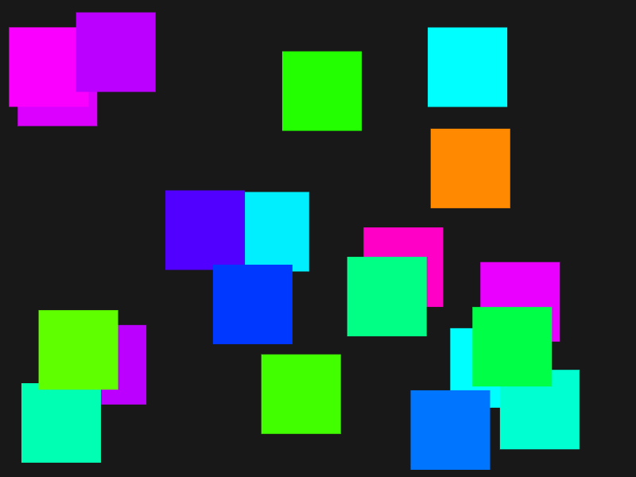

# C3 Demo

Artifacts of C3 Programming Language Streams. It's a simple demo that works Natively and in Web. Checkout the Web Version at https://tsoding.github.io/c3-demo/

The Native version uses [Raylib](https://www.raylib.com/) for rendering. The Web version uses [zozlib.js](https://github.com/tsoding/zozlib.js) which is a simple reimplementation of a Subset of Raylib API in JavaScript for WebAssembly. The result is the same program [demo.c3](./demo.c3) works both Natively and in Browser without any direct modifications.

## Building and Testing Web Version locally on Linux

- Install [C3 compiler](https://c3-lang.org/) and make sure `c3c` is avaible in `$PATH`
- `$ make`
- `$ python3 -m http.server 6969`
- Open <http://localhost:6969>

*TODO: to make this process cross-platform we need to get rid of `make` (c3 comes with its own build system, explore that, but keep it simple), and the Python HTTP Server ('cause Python is not guaranteed on Windows)*

## Building Native Version on Linux

- Install [C3 compiler](https://c3-lang.org/) and make sure `c3c` is avaible in `$PATH`
- `$ make demo-linux`
- `$ ./demo-linux`

*TODO: supporting more platforms is a matter of having a relevant [Raylib](https://www.raylib.com/) version and a target in the [Makefile](./Makefile)*
